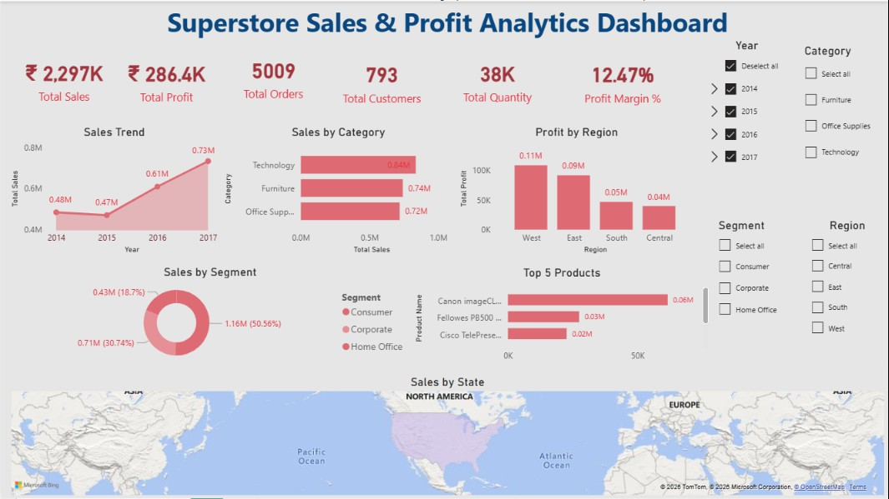

# 📊 Superstore Sales & Profit Analytics Dashboard



---

## 📌 Project Overview

This project analyzes the **Sample Superstore** dataset using **SQL (SQLite)** and **Power BI** to uncover business insights related to sales, profitability, customers, products, and regional performance.

The objective is to transform raw transactional data into an interactive dashboard that supports data-driven business decisions.

---

## 🎯 Business Objectives

- Analyze overall sales and profit performance.
- Identify top-performing product categories.
- Compare regional profitability.
- Understand customer segment contribution.
- Monitor sales trends over time.
- Identify top-selling products.
- Build an interactive executive dashboard.

---

## 🛠 Tech Stack

- Power BI
- SQL (SQLite)
- Microsoft Excel
- Git & GitHub

---

## 📂 Project Structure

```
Superstore-Sales-Dashboard
│
├── Dashboard
│   └── Superstore Dashboard.pbix
│
├── Dataset
│   └── Sample - Superstore.csv
│
├── SQL
│   ├── Data_Cleaning.sql
│   ├── Sales_Analysis.sql
│   ├── Customer_Analysis.sql
│   ├── Product_Analysis.sql
│   ├── Regional_Analysis.sql
│   └── Time_Analysis.sql
│
├── Images
│   └── Dashboard.png
│
└── README.md
```

---

## 🚀 Dashboard Features

✔ Executive KPI Dashboard

✔ Sales Trend Analysis

✔ Sales by Category

✔ Profit by Region

✔ Customer Segment Analysis

✔ Top Selling Products

✔ Geographic Sales Analysis

✔ Interactive Slicers

---

## 📊 Key Performance Indicators (KPIs)

- 💰 Total Sales
- 📈 Total Profit
- 🛒 Total Orders
- 👥 Total Customers
- 📦 Total Quantity Sold
- 📊 Profit Margin %

---

## 📝 SQL Analysis Performed

- Data Cleaning
- Exploratory Data Analysis (EDA)
- Sales Analysis
- Customer Analysis
- Product Analysis
- Regional Analysis
- Time-Based Analysis

---

## 📈 Key Business Insights

- Sales showed consistent year-over-year growth.
- Technology generated the highest sales.
- West region recorded the highest profit.
- Consumer segment contributed the largest share of revenue.
- A small number of products generated a significant portion of total sales.
- Regional analysis highlighted opportunities to improve profitability in lower-performing regions.

---

---

## 📷 Dashboard Preview


---

## 📬 Connect with Me

**Name:** Nidhi

**GitHub:** https://github.com/YourUsername

**LinkedIn:** https://linkedin.com/in/YourProfile

---

⭐ If you found this project useful, consider giving it a Star!
